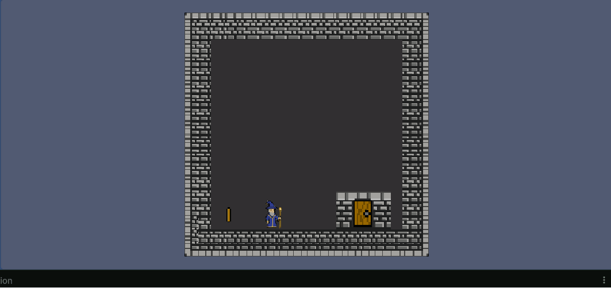
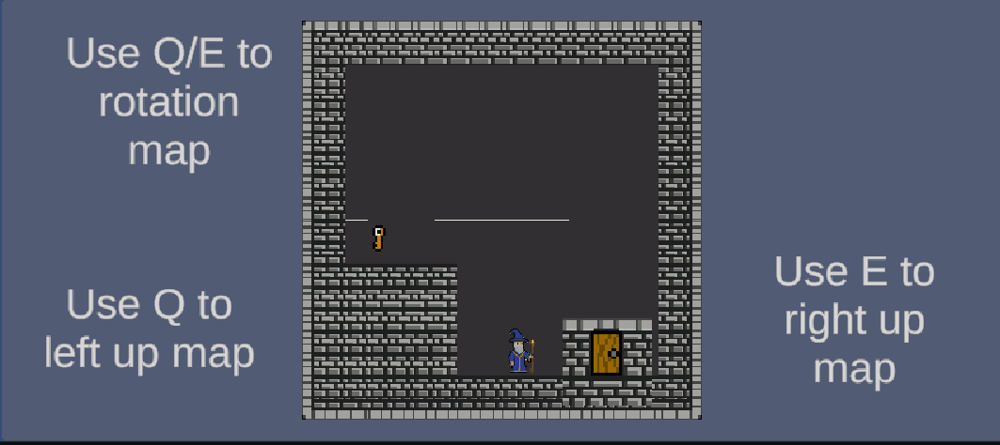

Spin Quest 

A 2D Puzzle Platformer built with Unity

Spin Quest là một 2D puzzle-platformer nơi người chơi điều khiển một phù thủy có khả năng thay đổi trọng lực để giải đố và vượt qua các chướng ngại vật.
Thay vì chỉ nhảy và di chuyển như platformer thông thường, người chơi có thể xoay toàn bộ bản đồ để thay đổi hướng di chuyển, tránh bẫy và tìm đường đến chìa khóa.

🎮 Gameplay
- Core Mechanic
    + Người chơi có thể xoay bản đồ 90° bằng phím Q/E, làm thay đổi hướng di chuyển và cách tiếp cận các platform.
- Gameplay loop:
1️⃣ Di chuyển qua map
2️⃣ Tránh bẫy và chướng ngại vật
3️⃣ Thu thập chìa khóa
4️⃣ Mở cửa để qua màn

- Gameplay GIF
    + Player Movement

⬇️ Thêm GIF gameplay di chuyển tại đây

- Map Rotation Mechanic

⬇️ Thêm GIF mechanic xoay map tại đây

- Puzzle Example

⬇️ Thêm GIF giải puzzle tại đây

🎮 Controls
- Key	Action
    + A / D	Move left / right
    + W	Jump
    + Q	Rotate map counter-clockwise
    + E	Rotate map clockwise
    + ESC	Pause game

🧩 Game Features
- Core Gameplay
    + Map rotation puzzle mechanic
    + Platformer movement system
    + Key & Door progression
    + Trap and hazard system

- Game System
    + Level progression system
    + Level unlock system
    + Save progress system
    + Pause / Win / Lose UI

- UI & UX
    + Main menu
    + Level selection screen
    + In-game UI
    + Pause menu

🏗 Project Architecture
Project được chia thành các module rõ ràng để dễ mở rộng.
Assets
 ├── Scripts
 │   ├── GameLogic
 │   │   ├── Player
 │   │   ├── Puzzle
 │   │   ├── Trap
 │   │   └── Door
 │   │
 │   ├── Manager
 │   │   ├── GameManager
 │   │   ├── LevelManager
 │   │   └── UIManager
 │   │
 │   └── UI
 │
 ├── Prefabs
 ├── Scenes
 └── Art

⚙️ Technical Highlights
- Map Rotation System

- Hệ thống xoay map cho phép xoay toàn bộ level 90° mỗi lần nhấn Q/E, tạo ra các puzzle traversal.

RotationMap.cs
- Key features:
    + Smooth rotation animation
    + Rotation cooldown
    + Player orientation adjustment
    + Player Movement System

Script:
PlayerMove.cs
- Features:
    + Horizontal movement
    + Jump system
    + Ground detection
    + Animation integration
    + Direction adjustment based on map orientation

Level Progression System
Script:
LevelManager.cs
- Features:
    + Unlock next level when completed
    + Save best performance
    + Track level stars
    + Persistent save system

🗂 Scenes

- Game hiện có các scene:
    + Menu
    + ChooseLevel
    + Level1
    ...
    + Level8

🚀 Getting Started
Requirements
Unity Version:
Unity 2022.x or newer
Run the project
1️⃣ Clone repository

git clone https://github.com/beoking01/SpinQuest.git

2️⃣ Open project with Unity Hub

3️⃣ Load scene
Assets/Scenes/Menu

4️⃣ Press Play

🛠 Future Improvements

- Planned improvements:
    + More puzzle mechanics
    + Moving platforms
    + Timed traps
    + Sound & VFX polish
    + More levels
    + Mobile support

👤 Author

Beoking
Game Developer / Unity Developer

GitHub
https://github.com/beoking01

📜 License
This project is for learning and portfolio purposes.
